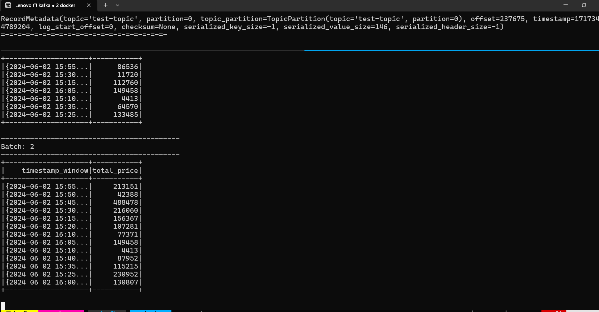

# Dibimbing, Data Engineering Bootcamp

1. Clone This Repo.
2. Run `make docker-build` for x86 user, or `make docker-build-arm` for arm chip user.

---
```
## docker-build                 - Build Docker Images (amd64) including its inter-container network.
## docker-build-arm             - Build Docker Images (arm64) including its inter-container network.
## postgres                     - Run a Postgres container
## spark                        - Run a Spark cluster, rebuild the postgres container, then create the destination tables
## jupyter                      - Spinup jupyter notebook for testing and validation purposes.
## airflow                      - Spinup airflow scheduler and webserver.
## kafka                        - Spinup kafka cluster (Kafka+Zookeeper).
## datahub                      - Spinup datahub instances.
## metabase                     - Spinup metabase instance.
## clean                        - Cleanup all running containers related to the challenge.
```

---

## Usecases
### Airflow Spark Job to Postgres
To Start run the below command after you run `make docker-build`
```bash
make airflow
make spark
make postgres
```
then go to airflow ui on port http://localhost:8081/ and start the dag

### Kafka Streaming Usecases
build the docker container with this command
```bash
make spark
make kafka
```
then run this command with different window terminal
for running kafka publisher
```bash
make spark-produce 
```

for running spark streaming to kafka use this
```bash
make spark-consume
```

### Documentation

